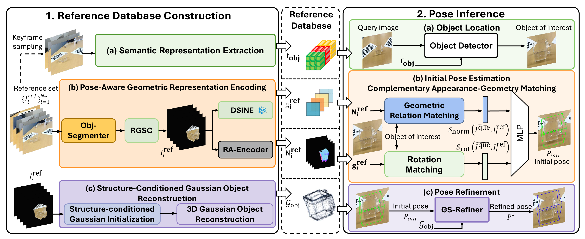

# StructAlign

**Structure-Guided Object Alignment for Transparent Object 6D Pose Estimation**

## Overall Framework

For the original PDF version, see [structAlign_overviwe.pdf](structAlign_overviwe.pdf).

## Repository Structure

- `checkpoints/`: trained model checkpoints.
- `config/`: configuration files.
- `dataset/`: dataset files and related instructions.
- `dataspace/`: data processing workspace and generated intermediate files.
- `model/`: model implementation.
- `reference_database/`: reference database files.
- `result/`: experiment outputs and evaluation results.
